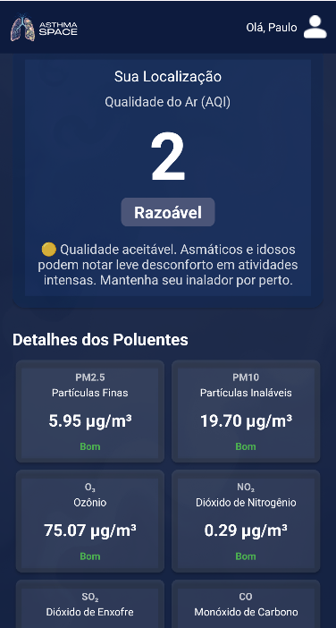
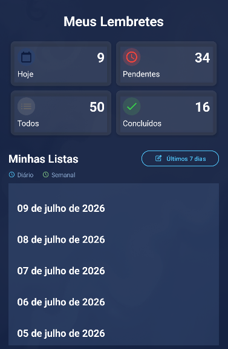
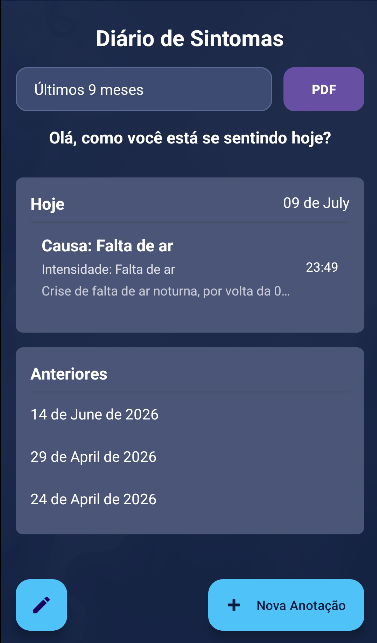
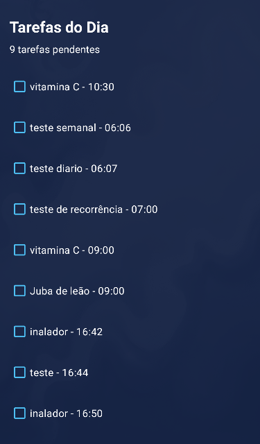

<div align="center">

# 🫁 Asthma Space

**Aplicativo mobile de gestão e bem-estar respiratório para pacientes com asma**

[](#)
[](#)
[](#)
[](#)

[📱 Download do APK](https://github.com/SEU_USUARIO/asthma-space-app/releases/latest) · [🌐 Landing Page](https://asthma-space-web-page.vercel.app/) · [📄 Documentação](docs/)

</div>

---

## 📌 Sobre o projeto

O **Asthma Space** é um aplicativo Android desenvolvido como projeto acadêmico na FMU, com o objetivo de auxiliar pacientes asmáticos no gerenciamento diário de sua condição respiratória. O app combina lembretes de medicação, diário de sintomas, monitoramento da qualidade do ar em tempo real e conteúdo educativo em uma única plataforma.

### Ecossistema

Este projeto é composto por **4 repositórios** que se integram:

| Repositório | Descrição | Stack |
|---|---|---|
| 📱 **[App Android](https://github.com/SEU_USUARIO/asthma-space-app)** *(este repo)* | Aplicativo mobile para pacientes | Java, Room, Retrofit2, WorkManager |
| ⚙️ **[Backend API](https://github.com/Paulo-back/AsmatchSpace)** | API REST com autenticação e regras de negócio | Spring Boot, Spring Security, JWT, Flyway |
| 🖥️ **[Painel Admin](https://github.com/Paulo-back/Asthma_Space-panel)** | Painel web administrativo com controle de acesso por perfil | HTML, CSS, JavaScript |
| 🌐 **[Landing Page](https://github.com/Paulo-back/AsthmaSpace_webPage)** | Página de apresentação do aplicativo | HTML, CSS, JavaScript |

### Arquitetura

```
┌─────────────────┐     ┌──────────────────┐
│   App Android   │     │   Painel Admin   │
│  (Java/Room)    │     │  (HTML/CSS/JS)   │
└────────┬────────┘     └────────┬─────────┘
         │      REST + JWT       │
         └───────────┬───────────┘
                     ▼
          ┌─────────────────────-┐      ┌──────────────────┐
          │  Backend Spring Boot │─────▶│   PostgreSQL     │
          │   (Render)           │      │   (Railway)      │
          └──────────┬───────────┘      └──────────────────┘
                     │
         ┌───────────┴───────────┐
         ▼                       ▼
┌─────────────────┐    ┌─────────────────┐
│  OpenWeather    │    │     ViaCEP      │
│ (qualidade ar)  │    │  (endereços)    │
└─────────────────┘    └─────────────────┘
```

---

## ✨ Funcionalidades

- **⏰ Lembretes de medicação** — Sistema de lembretes com recorrência (única, diária ou semanal), construído sobre um padrão *Template + Instances* que separa a definição da recorrência das ocorrências individuais
- **🌬️ Monitoramento da qualidade do ar** — Notificações automáticas em horários fixos ao longo do dia (7h às 22h), com dados da API OpenWeather Air Pollution (escala AQI 1–5), executadas de forma confiável mesmo com o dispositivo em Doze Mode
- **📓 Diário de sintomas** — Registro diário de sintomas com **geração de relatório em PDF** para compartilhar com o médico
- **⌚ Integração com Wear OS** — Sincronização com smartwatch via Wearable Data Layer API
- **🔔 Central de notificações** — Histórico persistente de notificações de qualidade do ar e lembretes
- **🔐 Autenticação segura** — Login com JWT, sessão persistente, fluxo de recuperação de senha com verificação de identidade e token com expiração de 15 minutos
- **📚 Conteúdo educativo** — Informações sobre asma e cuidados respiratórios

---

## 🛠️ Destaques técnicos

**Android**
- Arquitetura em camadas (`presentation` / `domain` / `data` / `core`)
- `ViewBinding` em todas as telas
- Persistência local com **Room**
- **Retrofit2** com `AuthInterceptor` para injeção automática do token JWT
- **AlarmManager** (`setExactAndAllowWhileIdle`) + **WorkManager** para execução confiável em background
- **Skeleton loading** (Facebook Shimmer) para mitigar cold starts do backend
- UI otimista com rollback em falhas de rede e proteção contra respostas obsoletas (*stale responses*) via contador de geração de requisições
- Geração de PDF com OpenPDF

**Backend**
- API REST com **Spring Boot** + **Spring Security** (JWT + BCrypt)
- Migrações versionadas com **Flyway**
- Controle de acesso por perfil (`ADMIN`, `MEDICO`, `USER`)
- Queries otimizadas em lote para respeitar limites do free tier
- Deploy no **Render** com keep-alive automatizado

---

## 📸 Screenshots

<!-- Adicione os prints do app aqui -->
| Home | Lembretes | Diário | Tarefas                        |
|---|---|---|--------------------------------|
|  |  |  |  |

---

## 📄 Documentação

A documentação completa do projeto está disponível na pasta [`docs/`](docs/):

- 📕 [Especificação do sistema (PDF, formato ABNT)](docs/Asthma Space - Documento de Especificação.pdf)
- 🏗️ [Decisões de arquitetura](docs/arquitetura.md)

---

## 🚀 Como executar

### Pré-requisitos
- Android Studio (Java 11+)
- Dispositivo ou emulador com Android 8.0+

### Passos

```bash
# Clone o repositório
git clone https://github.com/SEU_USUARIO/asthma-space-app.git

# Abra no Android Studio e sincronize o Gradle
# Configure o local.properties com sua chave da API OpenWeather:
# OPENWEATHER_API_KEY=sua_chave_aqui

# Execute no dispositivo/emulador
```

> **Nota:** o app consome a API hospedada no Render (free tier). A primeira requisição após inatividade pode levar alguns segundos devido ao cold start do servidor.

---

## 👥 Autores

Projeto desenvolvido em dupla como trabalho acadêmico na **FMU**:

- **Paulo Rosa** — [GitHub](https://github.com/Paulo-back) | [Linkedin](https://www.linkedin.com/in/paulo-henrique-rosa-dev/)
- **Edimário Silva de Paula** — [GitHub](https://github.com/DePaulaEd) | [Linkedin](https://www.linkedin.com/in/edimario-silva/)
- **Stefanne Pardim de Arruda Souza** — [Linkedin](https://www.linkedin.com/in/stefannepardim/)

---

## 📃 Licença

Este projeto foi desenvolvido para fins acadêmicos e de portfólio.